```{r message=FALSE, include=FALSE, warnings=FALSE}
library(knitr)
# make the images flow nicely
knitr::opts_chunk$set(fig.pos = 'H')
```


## Background

Considering the harmful effect of the urban noise on people the classification of the urban sounds my be used to identify which particular kind of noise is the most disturbing. Knowing this the architects and builders may come-up with the better sound insulation materials and building designs to shield the dwellers from for the most distractive sounds. The machinery manufacturers could produce better soundproofed equipment...


## Objective

Objective of this research is to build a robust urban sound classifier leveraging concepts from transfer learning and deep learning. The model should be able to deal with the sound samples of various duration, number of channels and sample rate.
The model should work fast enough to classify the sound samples in real-time.

## GitHub

The project source code, presentation and other artifacts could be found on [GitHub](https://github.com/v2msLabs/ML1020-Course-Project) 


# Data Analysis

This research employs the data set sourced from [UrbanSounddataset](https://urbansounddataset.weebly.com/urbansound8k.html).
This dataset contains **8732** labeled sound excerpts (<=4s) of urban sounds from 10 classes. The classes are drawn from the urban sound taxonomy. The files are pre-sorted into ten folds (folders named fold1-fold10) to help in the reproduction of and comparison with the automatic classification results. We will follow a standard workflow of analyzing, visualizing, modeling, and evaluating our models on our audio data.
 

## Data Dictionary

### Audio Files
8732 audio files (6 GB) of urban sounds (see description above) in WAV format. The sampling rate, bit depth, and number of channels are the same as those of the original file uploaded to Freesound (and hence may vary from file to file).

The name of the audio file. The name takes the following format: *[fsID]-[classID]-[occurrenceID]-[sliceID].wav*. We are primarily interested in `classID` - a numeric identifier of the sound class. There are ten sound categories, namely:

    0 = air_conditioner
    1 = car_horn
    2 = children_playing
    3 = dog_bark
    4 = drilling
    5 = engine_idling
    6 = gun_shot
    7 = jackhammer
    8 = siren
    9 = street_music


### Meta-data File
This file contains meta-data information about every audio file in the dataset.This includes:

## Data Exploration

Let's begin our data exploration exercise checking the content of the meta-data file supplied with the audio samples:

```{r  out.width = "50%", echo=FALSE, fig.align='center', fig.cap="The Meta-data File Content Sample"}
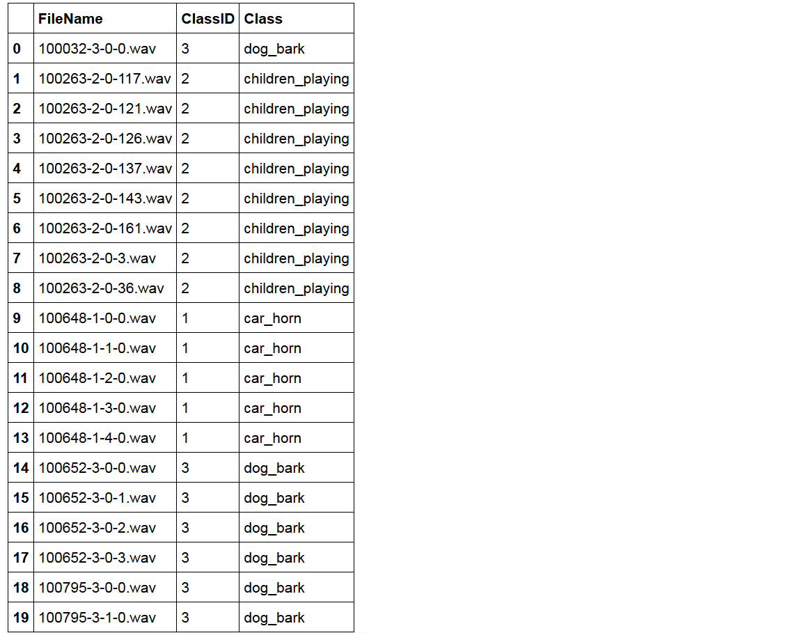 
```

Employing the meta-data file content and the audio samples we will try to gain better understanding of the data we are dealing with. This knowledge will help us to prepare data for model training.

We begin with counting the number of observations per category.

```{r  out.width = "70%", echo=FALSE, fig.align='center', fig.cap="Number of Observations Per Category"}
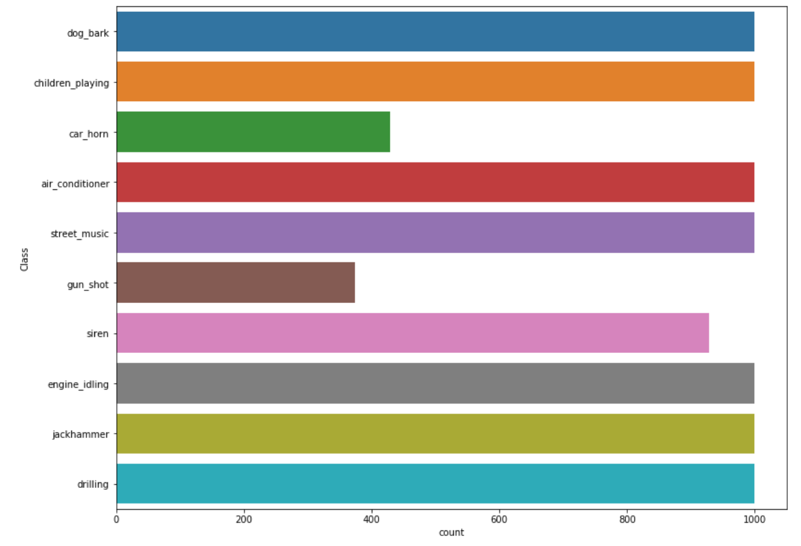 
```

As per the plot submitted above we can see that the **Gun Shot** and **Car Horn** categories are underpopulated; the data set is not balanced. To balance the dataset we could:

1. Upsample these categories
2. Downsample the populous categories
3. Add more labelled observations to the smaller categories
4. Leave the data set as is hoping that the categories with the smaller population will be large enough to train the network

We decided to go with option **1** since it gives us the best quality. But now we face a question how to upsample the audio. The answer is sound augmentation. We can take the existing audio samples and alter them adding noise, changing the pitch and time shift. This technique proved to be very effective to improve the accuracy of the models. 

Now it is time to take a look at the audio sample rate distribution. As shown in figure \ref{fig:sampled} the sample rate of the sound files varies. We would have to re-sample the original data to bring it to the same standard.

```{r sampled, out.width = "100%", echo=FALSE, fig.align='center', fig.cap="Audio Sample Rate Distribution"}
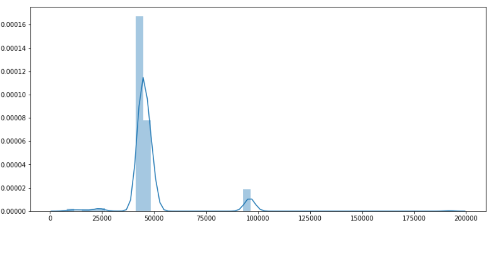 
```

Let's calculate the length of the sound samples.

```{r lengthd, out.width = "100%", echo=FALSE, fig.align='center', fig.cap="Audio Length Distribution"}
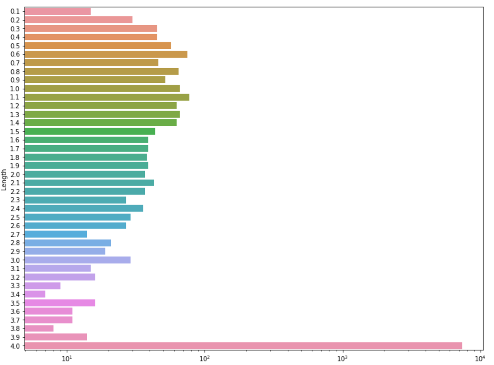 
```

The majority of the sound files are **4** second long (fig: \ref{fig:lengthd}). But there are some file that are less than a second long. Designing the model we would have to make sure that the input layer is able to deal with the sound samples of various length and a sample rate. We might also want to filter out the samples that less than **0.5** second long, because most likely they do not carry much of valuable information.

Lastly we are going to verify how many channels the recorded audio file have (stereo vs. mono)

```{r channeld, out.width = "50%", echo=FALSE, fig.align='center', fig.cap="Mono vs. Stereo Sample Distribution"}
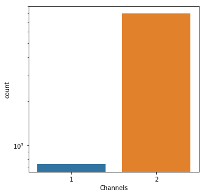 
```

Just a few audio files were recorded in mono. Though each stereo channel carries slightly different information for the sake of simplicity we will be converting each audio sample to monophonic.

### Sound Characteristics of Each Category

To successfully classify the urban sounds each sound category must have distinctive features. Applying audio feature extraction library **librosa** (Ref: \cite{librosa}) we are going to take a look at one sample from each category to witness the difference.

The most common and well understood audio chart is a `waveform amplitude plot`.  The pattern of variations contained in the waveforms gives us information about the signal.

```{r waveform, out.width = "100%", echo=FALSE, fig.align='center', fig.cap="Waveforms of Sounds from All Ten Categories"}
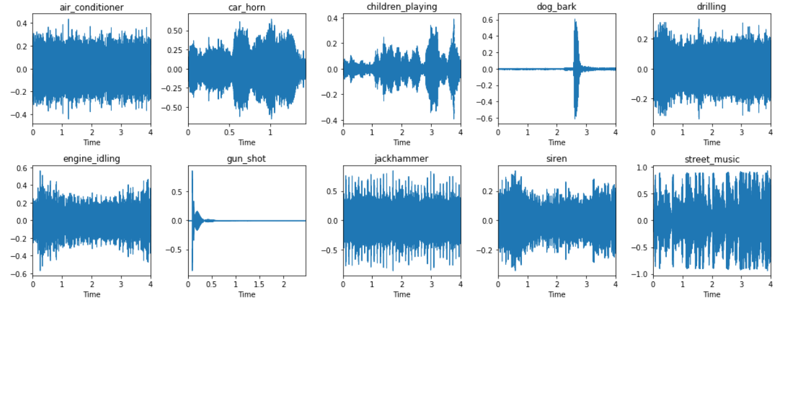 
```
Looking at the waveforms rendered in figure: \ref{fig:waveform} we can observe that some sounds have very distinctive shape. On the other hand the plot of the **air conditioner** and **jackhammer** are somewhat similar. Is there a better way to pick the distinctive sound features? In fact over time the sound engineers and scientist came up with many way to describe the unique characteristics of the sound. We have decided to employ **Mel spectrogram**. Mel frequency spectrogram is a lossless presentation of a signal that gives an acoustic time-frequency representation of a sound: the power spectral density. It is sampled into a number of points around equally spaced times and frequencies (on a Mel frequency scale). The Mel scale is a **perceptual** scale of pitches judged by listeners to be equal in distance from one another. 

```{r mel, out.width = "100%", echo=FALSE, fig.align='center', fig.cap="Mel Spectrograms of Sounds from All Ten Categories"}
include_graphics("../images/melSpecGraphs.png") 
```

As we can see the Mel spectrograms have more features than the amplitude/time waveform presentation. Now the distinction between the the **air conditioner** and **jackhammer**r is much clearer. Since the spectrograms are lossless they could be used to train the Neural Networks!


# Data Preparation

Taking into consideration the finding discovered during the data exploration phase we are ready to design a dataset preparation and feature extraction approach.

* Firstly we shall balance the data set employing sound augmentation techniques as previously discussed. 
* We re-sample all audio using a sample rate of **22050 Hz**
* All sound samples will be converted to **mono**
* As it was noted the length of the audio samples varies from 0.1 to 4 seconds. To preserve as much data as possible we will apply a sub-sampling technique known as a *sliding window approach*. 

    * We select a window size of **0.5** seconds, which we use against each audio sample to slice it into 0.5-long audio segments.
    * The window will be moving from the beginning of the audio file to the end with overlap of 0.25 seconds.
    * Most of the times the sliding window would not cut the audio file precisely from the beginning to the end. Thus the last slice will be taken from the end of the audio sample.
    * This approach will result in getting multiple overlapping samples from each audio file.
    

# Feature Extraction

Now let's ponder about the features we would have to extract to design a robust classifier. Long before the neural networks gained their popularity the scientist had already come up with pretty accurate methods to classify the sound. The star feature of the time was **Mel-frequency cepstral coefficients (MFCCs)** (Ref: \cite{mfccmodel}). With the expansion of the Neural Networks multiple research works demonstrate that **log-scaled Mel spectrogram** is superior to the other features extraction techniques in the context of deep learning models (Ref: \cite{audiosignal}).

Our feature extraction approach is based on the latest scientific findings and largely inspired by the "Hands-On Transfer Learning with Python" book (\cite{transfer}). Below we outline our feature extraction sequence.

To capture more data we are going to use **96-band** Mel spectrogram over **96** frames for each audio sample. When the spectrogram is extracted we can use it as an input for a Convolutional Neural Network. In the end the spectrograms could be rendered as an image. The CNN would learns the features of the spectrograms and then classify them. But there is a better approach... There are literally dozens of pre-trained models. Thousand hours have been spent on the model training and design. Can we take advantage of this work? Absolutely!

We are going to employ **VGG-16** convolutional neural network trained on millions of images from "imagenet" to learn the features of the Mel spectrograms, which we described just a moment ago. We would have to modify the VGG-16 architecture, namely:

* We shape the input layer as follows: ${96} * {96} * {3}$
* We drop the softmax output layer
* We flatten the last layer of the network

Here is the the modified VGG-16 architecture:

```{r vgg, out.width = "30%", echo=FALSE, fig.align='center', fig.cap="VGG-16 Architecture"}
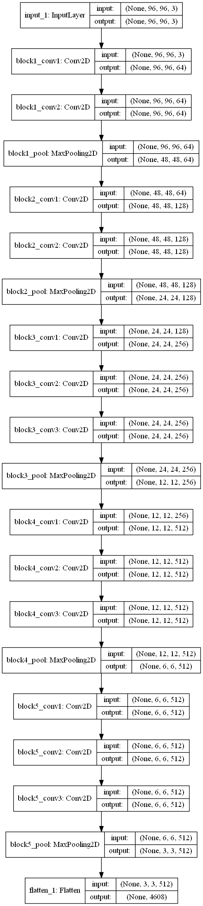 
```
The output  of the model is a one-dimensional feature vector of size **4608**. There is one small issue though. VGG-16 is trained on the three-channel (RGB) images. In our case we have only one ${96} * {96}$ matrix. We can consider a few solutions... The first one is to extract two more features. The best candidates would probably be *Harmonic* and *Percussion* sequences. But earlier in the paper we have noted that the Mel spectrograms are lossless. Addition of new feature would undoubtedly make negative performance impact, but would it add more data? We do not believe so. Thus we decide to replicate the same matrix three times.

## Production Pipeline

Considering everything said above this is a diagram of the production data pipeline

```{r pipeline, out.width = "100%", echo=FALSE, fig.align='center', fig.cap="Production Pipeline"}
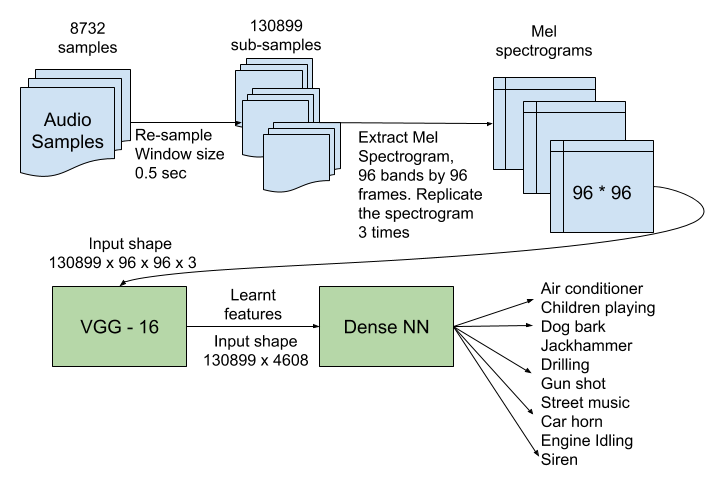 
```

# Classification Model

Heavily relying on the power of the transfer learning our classifier is going to be rather simple. It is a dense neural network that has input layer of size **4608** that matches the output of the VGG-16 NN. The classifier has a few dropout layers to fight the overfitting. The output layer of the classifier has softmax activation function with ten outputs - one for each sound category. As you may recall we started with 8736 audio files of various length. After data processing and feature extraction steps we ended-up with the dataset of **130899** rows and **4608** columns!

```{r classifier, out.width = "30%", echo=FALSE, fig.align='center', fig.cap="Classification Model"}
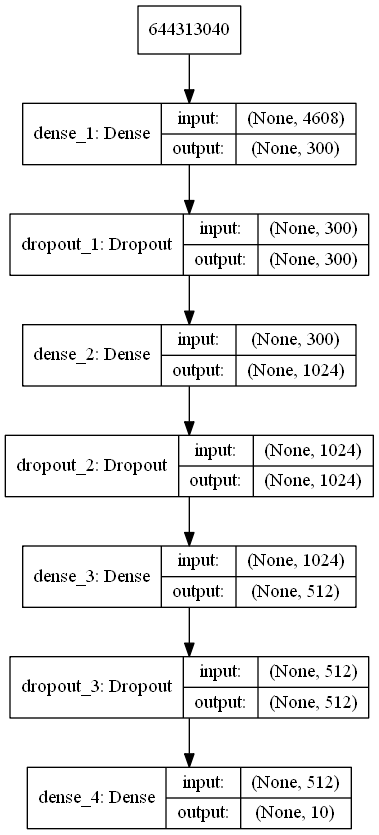 
```

# Model Deployment and Training on Google Cloud Platform

GCP offers many ways to achieve the same goal. We frankly have been overwhelmed with the number of available articles and training materials, which in fact made the things more confusing than helpful. We have spent considerable amount of time studying various approaches. As it has been previously discussed our processing pipeline is quite complex. To implement it on the cloud we have designed the following workflow...

## Grand Design

1. Upload audio file to a GCP bucket.
2. Run data normalization and feature extraction job on GCP AI Platform
3. Save the output of the job as a pickle file in a temporary folder of the bucket.
4. Develop a serverless GCP function to learn the features employing VGG-16. The pickle files produced by the AI job would be used as input for VGG-16. The function would be triggered by the storage event in reaction to the creation of the feature pickle file. Dump the pickle file with the learned features
5. Develop a serverless function to train the classification model. Similarly to step 4 trigger the function execution propagating a storage event. Use the pickle file with learnt features as input

## Reality

As it turned out it was a formidable task to implement the proposed above design. It could have taken weeks to develop such pipeline even for experienced GCP developers. Thus, considering the time constraints and luck of experience dealing with GCP we have come up with a hybrid approach.

1. To do data normalization and feature extraction we developed a configurable Python script that would take the original audio samples as input and produce a pickle file of features and labels as an output. We run a few of these files simultaneously on a PC. Each file took care of the portion of the audio files and process them creating the pickle files.
2. As a result of the step one we ended up with 11 feature and corresponding 11 label files. Then we developed and ran the feature learning jobs employing VGG-16 model. Each job would take a pickle feature file produced by the feature extraction jobs at the step one. The outcome of these processes were 11 pickle files with the learnt features. The feature learning jobs we run simultaneously on a PC
3. Then we ran the **stacker** script in a local environment to consolidate 11 pickle files with the learnt features into one files and corresponding 11 label files into another file.
4. We uploaded the pickle files produced at step # 3 to GCP bucket
5. Lastly we developed and run a model training job on GCP AI Platform

The diagram submitted below illustrates the process
```{r impl, out.width = "100%", echo=FALSE, fig.align='center', fig.cap="Pipeline Implementation"}
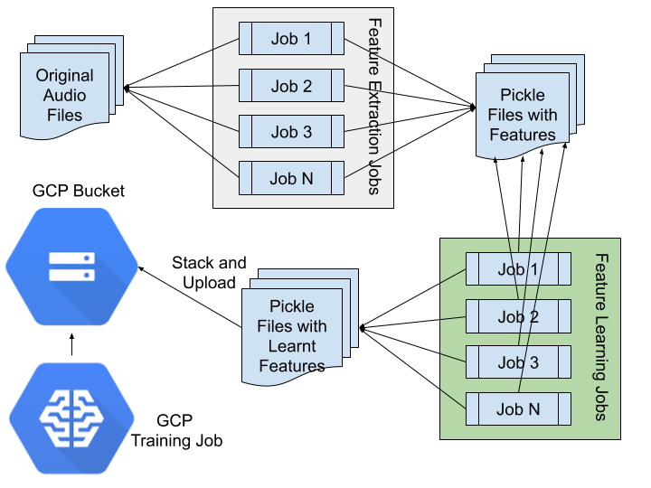 
```

## Training

We have opted to employ **GCP AI Platform** job to train the model. The advantage of this approach is a zero hardware configuration effort. The AI platform takes care of the job scaling. We selected a scale tier of **PREMIUM_1**, which comprises:

* One master instance
* 19 workers 
* 11 parameter servers

Compute Engine machine name, master: n1-highcpu-16, workers: n1-highcpu-16, parameter servers: n1-highmem-8

The model training was done using 50 epochs, with the batch size of 256 and validation set size equaled to 25% of the training dataset. We chose Adam optimizer and opted to employ learning rate decay. The following group of diagrams show the GCP training job statistics.

```{r grah, out.width = "80%", echo=FALSE, fig.align='center', fig.cap="Model Training Graph"}
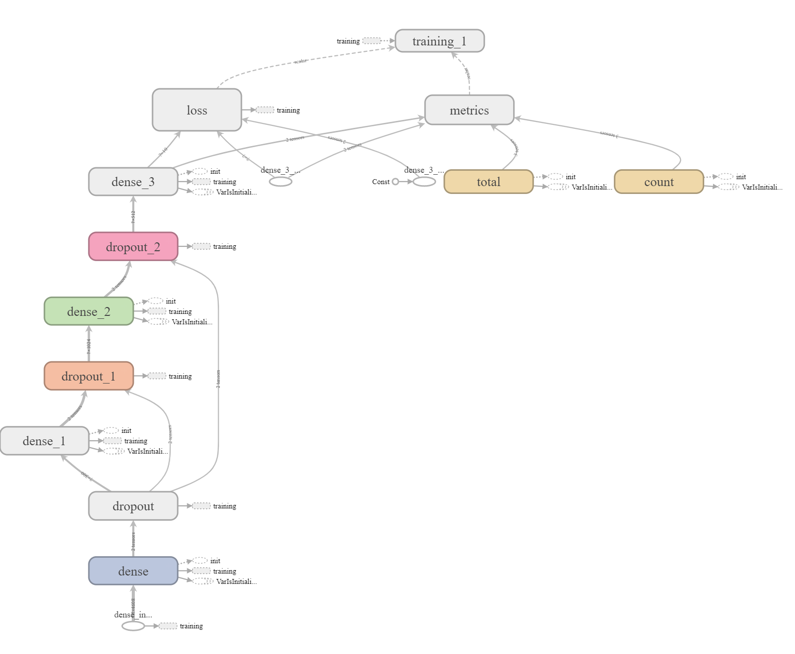 
```
```{r net, out.width = "100%", echo=FALSE, fig.align='center', fig.cap="Job Network Traffic"}
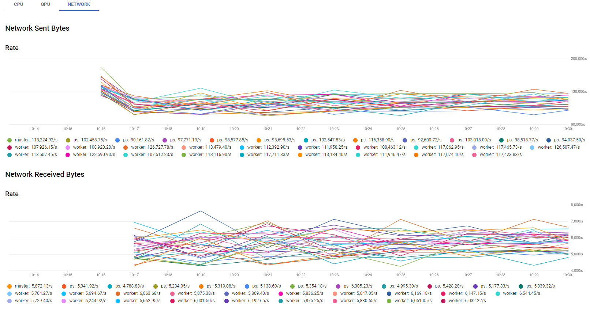 
```
```{r master, out.width = "100%", echo=FALSE, fig.align='center', fig.cap="Master Server CPU and Memory Utilization"}
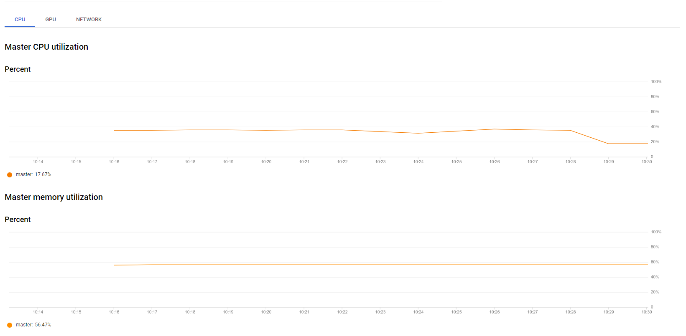 
```
```{r param, out.width = "100%", echo=FALSE, fig.align='center', fig.cap="Parameter Servers CPU and Memory Utilization"}
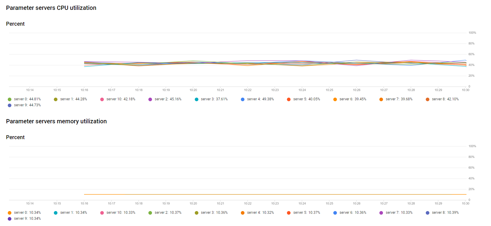 
```
```{r worker, out.width = "100%", echo=FALSE, fig.align='center', fig.cap="Worker Servers CPU and Memory Utilization"}
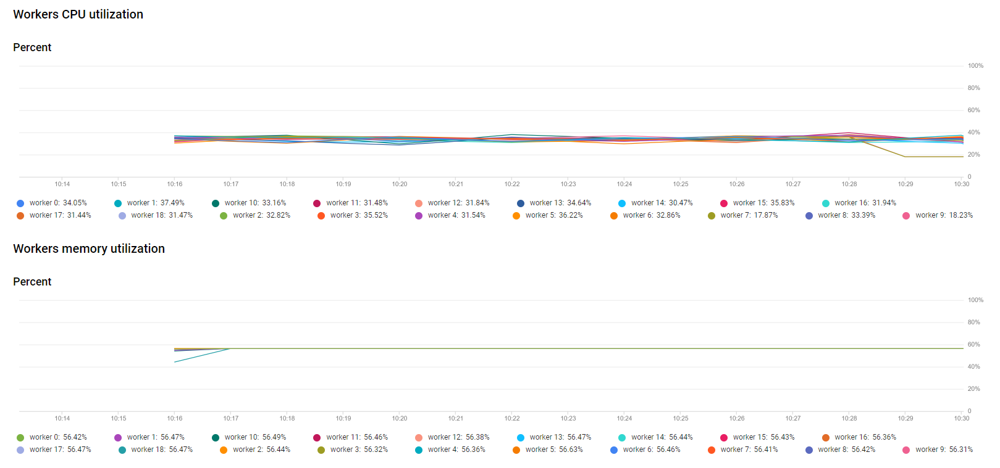 
```

The GCP job finished in 16 minutes.

Let's review the model training and validation curves, which will help us to evaluate how well the model is fitted and if there are ways to improve it. According to figure \ref{fig:loss} training and validation accuracy are nicely converging, which is a sign that the model has learned the data well. Both curves lay in close proximity and follow each other. It means the the training and validation sets are representative, meaning they contain all the features of the original dataset.The training and validation loss curves on the right hand side, have converged and plateaued. It means that further training will most likely lead to overfitting.

```{r loss, out.width = "100%", echo=FALSE, fig.align='center', fig.cap="Model Training and Validation Curves"}
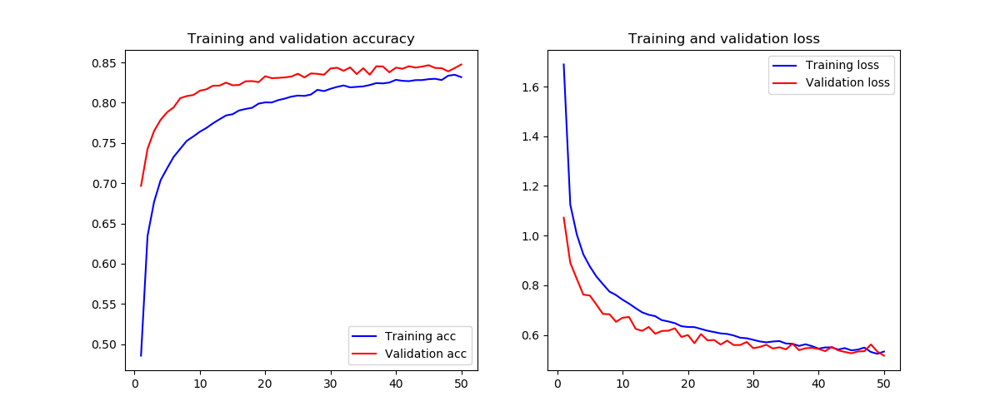 
```

Lastly we are going to evaluate the confusion matrix of the classifier. And it is quite impressive! All averaged F1 scores show **85%** accuracy on a training set. This is quite remarkable considering how simple the classifier model is. Power of transfer learning in action! The least successful categories are `Children Playing`, `Dog Bark` and `Steet Music`. All scored i mid/high seventies. The lower ability to classy `Children Playing` and `Street Music` could be explained by the complexity of the sound. Probably more samples would help to improve the classifier. We are not sure why `Dog Bark` category has a lower score.  

```{r heat, out.width = "100%", echo=FALSE, fig.align='center', fig.cap="Classifier Confusion Matrix"}
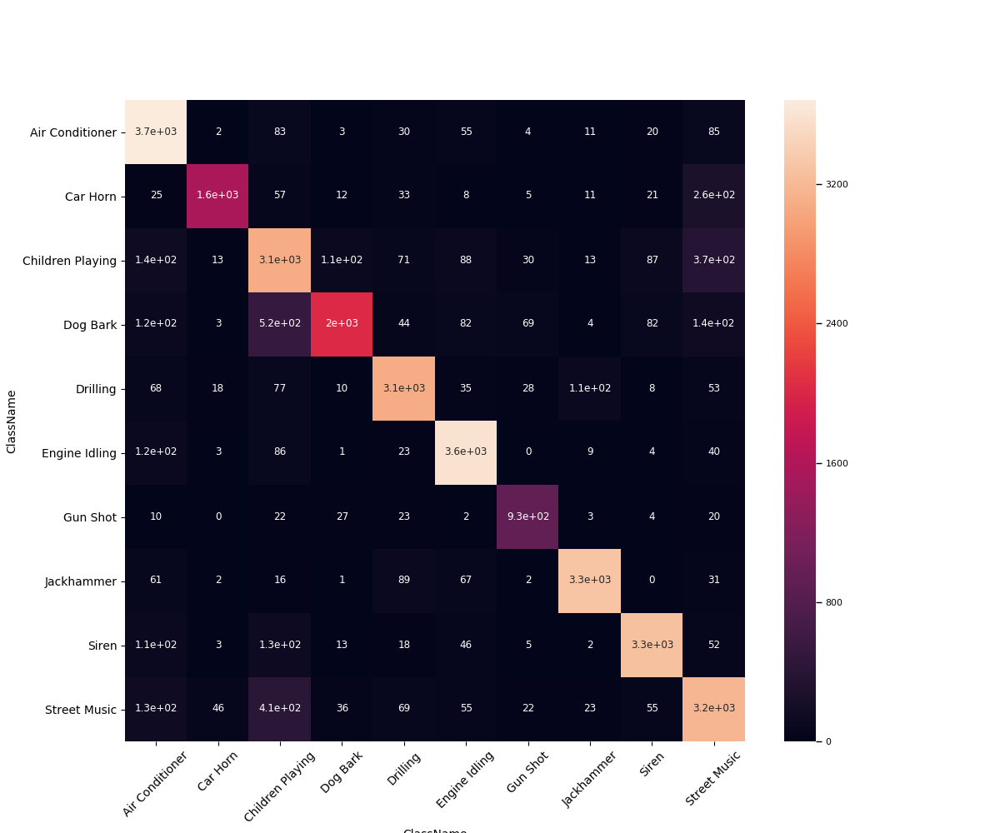 
```

                  precision    recall  f1-score   support

    Air Conditioner    0.83      0.93      0.87      3977
        Car Horn       0.95      0.78      0.86      1998
    Children Playing   0.69      0.77      0.73      4009
        Dog Bark       0.91      0.65      0.76      3084
        Drilling       0.89      0.88      0.88      3492
    Engine Idling      0.89      0.93      0.91      3877
        Gun Shot       0.85      0.89      0.87      1038
      Jackhammer       0.95      0.92      0.94      3571
           Siren       0.92      0.90      0.91      3656
    Street Music       0.75      0.79      0.77      4023

       micro avg       0.85      0.85      0.85     32725
       macro avg       0.86      0.84      0.85     32725
    weighted avg       0.85      0.85      0.85     32725


# Conclusion

Our research proves that having even modest computational resources it is possible to classify urban sounds with the high degree of accuracy. Through exploration of almost 9000 audio samples we have extracted useful features, which we employed to train the sound classification model. We have confirmed that the data augmentation is an excellent tool to balance the unbalanced datasets or even boost the size of the small dataset. We have demonstrated the power of the transfer learning, which makes training o high accuracy models with limited resources possible.


\bibliography{RJreferences}

# Note from the Authors

This file was generated using [_The R Journal_ style article template](https://github.com/rstudio/rticles), additional information on how to prepare articles for submission is here - [Instructions for Authors](https://journal.r-project.org/share/author-guide.pdf). The article itself is an executable R Markdown file that could be [downloaded from Github](https://github.com/ivbsoftware/big-data-final-2/blob/master/docs/R_Journal/big-data-final-2/) with all the necessary artifacts.
