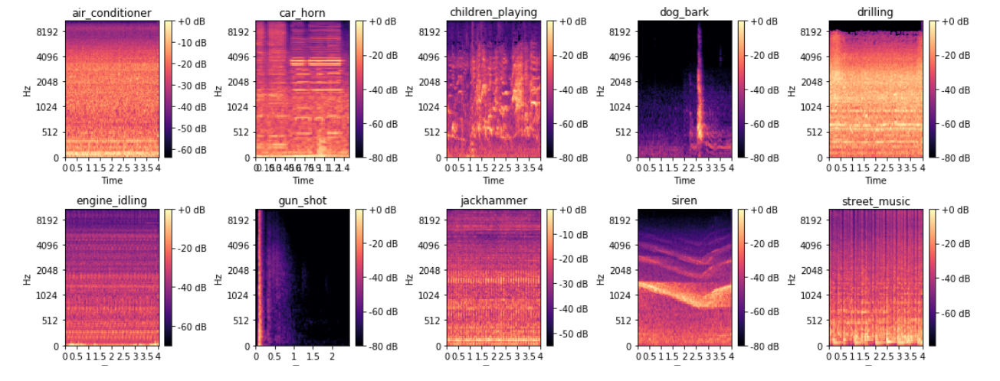

```{r echo=FALSE, message=FALSE, warnings=FALSE}
library(rmarkdown)
```

# Project: Urban Sounds Classification
## Background

We will be leveraging concepts from transfer learning and deep learning to build a robust classifier whereby, with any given audio sample belonging to one of our pre-determined categories, we should be able to correctly predict the source of this sound. The dataset we will be using is popularly known as the UrbanSound8K dataset. UrbanSounds8K dataset has 8,732 labeled audio sound files (the duration of which are usually equal to or greater than 4 seconds) that contain excerpts from common urban sounds.


## Objective

This study is to analyze the audio sounds and classify to the appropriate class with certain degree of confidence.
We will employ CRISP-DM methodology deep Learning and utilize Transfer Learning to achieve this goal.


## Data Analysis  

This research employs the data set sourced from [UrbanSounddataset](https://urbansounddataset.weebly.com/urbansound8k.html).
This dataset contains 8732 labeled sound excerpts (<=4s) of urban sounds from 10 classes: air_conditioner, car_horn, children_playing, dog_bark, drilling, enginge_idling, gun_shot, jackhammer, siren, and street_music. The classes are drawn from the urban sound taxonomy.
The files are pre-sorted into ten folds (folders named fold1-fold10) to help in the reproduction of and comparison with the automatic classification results.
We will follow a standard workflow of analyzing, visualizing, modeling, and evaluating our models on our audio data.

**Audio Files**  
8732 audio files of urban sounds (see description above) in WAV format. The sampling rate, bit depth, and number of channels are the same as those of the original file uploaded to Freesound (and hence may vary from file to file).

**Meta-data Files**  
This file contains meta-data information about every audio file in the dataset.This includes:

**Slice_file_name**  
The name of the audio file. The name takes the following format: [fsID]-[classID]-[occurrenceID]-[sliceID].wav, where:

**sliceID**
A numeric identifier to distinguish different slices taken from the same occurrence

**fsID**  
The Freesound ID of the recording from which this excerpt (slice) is taken

**Start**  
The start time of the slice in the original Freesound recording

**end**  
The end time of slice in the original Freesound recording

**salience**  
A (subjective) salience rating of the sound. 1 = foreground, 2 = background.

**fold**  
The fold number (1-10) to which this file has been allocated.

**classID**  
A numeric identifier of the sound class:
0 = air_conditioner
1 = car_horn
2 = children_playing
3 = dog_bark
4 = drilling
5 = engine_idling
6 = gun_shot
7 = jackhammer
8 = siren
9 = street_music

**class**  
The class name: air_conditioner, car_horn, children_playing, dog_bark, drilling, engine_idling, gun_shot, jackhammer, siren, street_music.

We start our research with the feature exploration and understanding.


Let's load the train data and explore available classes and sample distirubtion between the classes. note: the test data is not labled thus it is useless for the training purpose. We have no choice but employ the train dataset to train and validate the model. The librosa module is an open source Python framework for audio and music analysis. We will be using this for analyzing as well as extracting features from audio data in subsequent sections.


### Basic Data Statistics  

Gun Shot and Car Horn categories are underpopulated. We could:
1. Digitize and upsample these categories
2. Upsample all categories
3. Add more labelled observations to the smaller categories
4. Leave as is hoping that the categories with the smaller population will be enough to train the network


#### Sample Rate Distirbution  
Evidently the sample rate of the sound files varies. We would have to resample the original data to bring it to the same standard. Let's caclulate the length of the sounds.  


  


#### Duration of Sound Files  
Evidently the sample rate of the sound files varies. We would have to resample the original data to bring it to the same standard. Let's caclulate the length of the sounds


#### Visualize the Audio Files  
Let's now visualize what these different audio sources look like by plotting their waveforms. This will be a waveform amplitude plot for each audio sample:


The waveform charts rendered above clearly show that each sound class has distinctive characterisitcs, such as rhythm, amplitude, etc. Though some classes are have more similarities than the other, for example Air Conditioner and Engine Idling feature rather similar, monotonus sound. Let's apply another popular technique that exposes the features of the sound even better mel spectogram. The name mel comes from the word melody. This indicates that the scale is based on pitch comparisons. The melscale is thus a perceptual scale of pitches that have been judged by listeners to be equal in distance from one another.


#### Melody Spectogram




### Data Preprocessing  


Firstly we shall balance the data set. We can achieve this by applying the augmentation technique to the existing audio samples that belong to Gun Shot and Car Horn categories. We will introduce random noise, change the pitch and shift time of the audio.


The audio files for category 1 - Car Horn and 6 - Gun Shot was upsampled.
Thus after this step the aforementioned categories will double in size, getting at par with the other categories


Considering the fact that the audio files have different length we will sample each audio file using a sliding, overlapping window, which is 500 ms long. This technique allows us to normalize input for our model without loosing to much data. The files that are shorter than 500 ms will be discarded.

All the audio files were resampled applying 22050hz sample rate and convert all the files to mono.


### Feature Engineering

Now let's ponder about the features we would have to extract to design a robust classifier. In the past Mel-frequency cepstral coefficients (MFCCs) were considered the best to classify the audio. With the expansion of the Neural Networks multiple research works prove that log-scaled mel spectrogram is superior to other features extraction techniques.

To capture more data we are going to use 96 mel spectrogram bands and 96 frames for each sample. To build a good classifier we have to find ways to effectively extract useful features from the mel spectrograms. There are two approaches.  

* We Either:
    + train our own feature extraction conlvolutional neural network  
    + or we opt to employ the power of transfer learning and use pre-train conlvolutional network.


We choose to do the later... One of the pretrained deep learning models that proved to be very effective for feature extraction on images is VGG-16. VGG-16 has been trained on RGB images, thus it requires three channel input. The mel spectrogram has one dimension.

* There are a few solutions possible

    + Add two more channels during pre-processing, for example log scaled percussion and harmonic sequences
    + Replicate the spectrogram data twice to form 3-dimensional input
    + Converts spectrogram to lossless image and use it as input for VGG


It seams that the first approach dose not add more data to the model to analyze. The mel spectrogram is a lossless presentation of audio. The third option does not enrich data either but introduces additional computation. So we go with the second approach.


## Feature Extraction Model (VGG16)


## Multiclass Classification Model  
The classification model will be dealing with the one-dimensional feature vector of size 4608 The output layer is going to be a softmax layer with ten outputs - one for each class.

The classification task seems to be pretty trivial. We will be employing a multi-layer dense perceptron with Adam optimizer and categorical cross-entropy loss function. We will insert a few drop layers between the dense ayer to avoid model over-fitting.

## Full Production Pipeline in Action  


## Conclusion


\bibliography{RJreferences}

## Note from the Authors

This file was generated using [_The R Journal_ style article template](https://github.com/rstudio/rticles), additional information on how to prepare articles for submission is here - [Instructions for Authors](https://journal.r-project.org/share/author-guide.pdf). The article itself is an executable R Markdown file that could be [downloaded from Github](https://github.com/ivbsoftware/big-data-final-2/blob/master/docs/R_Journal/big-data-final-2/) with all the necessary artifacts.
